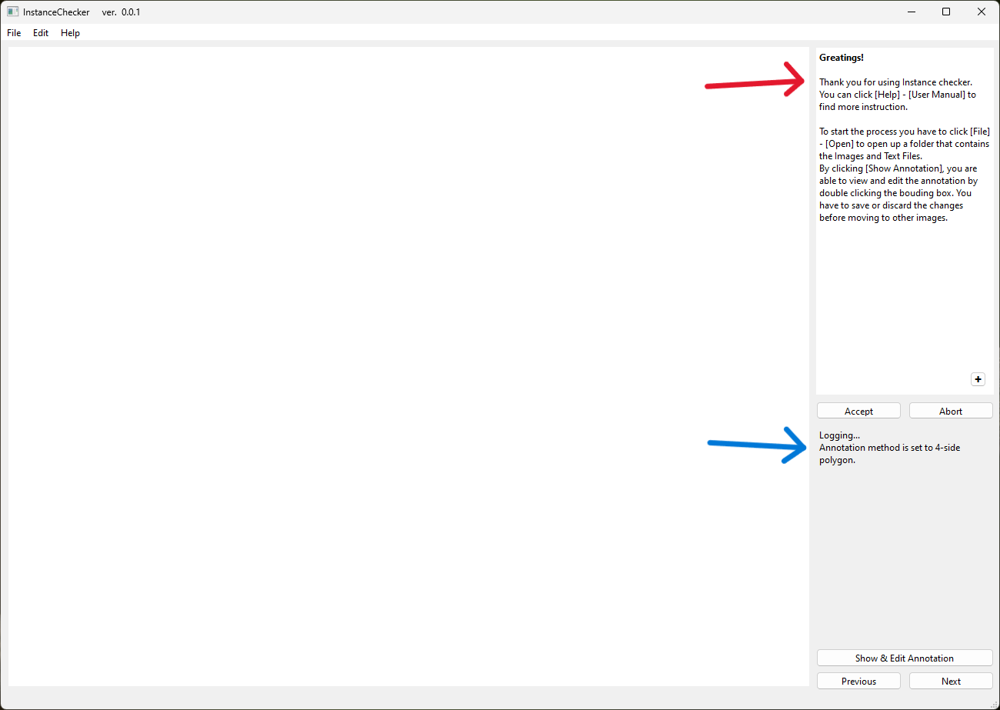
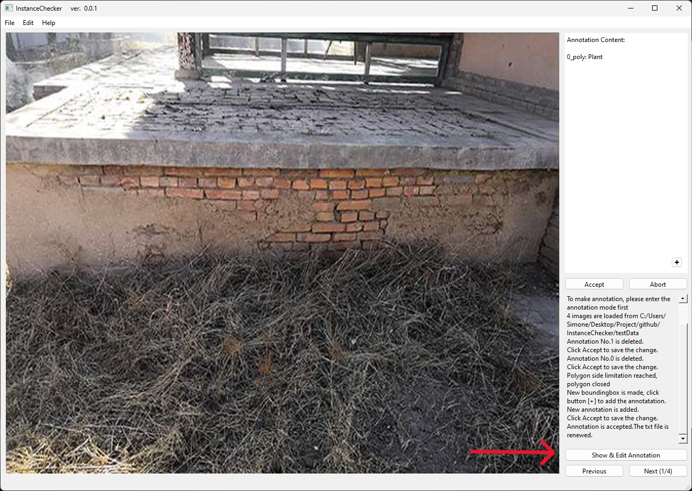
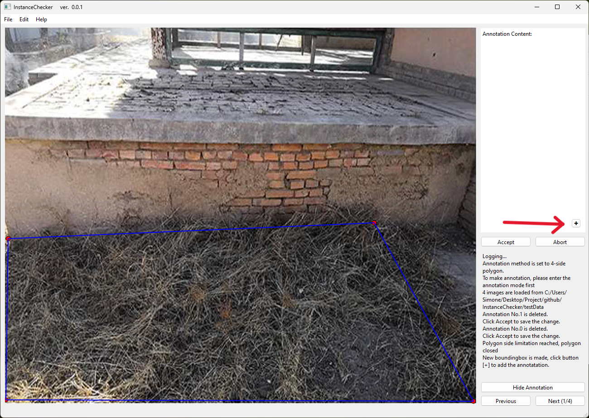

# InstanceChecker
**Powered by 3DSurveyGroup | DABC | Politecnico di Milano**
***
### Introduction
_The tools for preparing training set for Object detection job_

This easy software is design to help us collect annoataion of images. Other availble softwares are too much complicated with unneccesary functions, and cannot be customed to our need. Therefore we use this one.

What you can expect:
- You can annotate the image files from scrath
- You can edit already provided annotation, change the classification and cancel them.
- **This software will automatically generate the txt file that records your annotation, please send back to us these files.**

### Interface OverView

The interface is giving you a frame of $640 \times 640$ on the left. One the right we have a board that gives the list of annotated instances (indicated by the red arrow) and the a log board at the bottom right (indicated by the blue arrow). From the log board some suggestions will be made to guide your operation. 

### Getting started
In order to start you have to:
1. Click **[File]** - **[Open]** to load **the folder of the images and txt files**.
    
2. Click '**Show && Edit Annotation**' to show the annotation of the current image.
    You can double click an existing box to edit previous annotation.
    
3. You can also drag a box and click **[+]** to add new annotation.
   ==Notice that the new annotation will not be added if the annotation has overlap ratio with existing bounding box over **50%**.==
   
   It's prefered that you annotate with smaller and continuous bounding boxes for objects that takes the diagonal area of the corresponding area. In this way, it's possible also to annotate the part that is left.
   
   After clicking **[+]** buttom, you will be able to access to the annotation window.
       
   In the list you can choose the predefined categories. You can also opt to delete the current annotation.  
   
4. You can also double click the existing box to edit current annotation.
5. Click **[Accept]** or **[Abort]** to save or cancel the modification.
    ==Note that if you don't do that, the software will not allow you to go to other images.==
6. Click '**Next**' or '**Previous**' to switch to the next or previous image.

### Contact Information
If you happened to be encountering any problem, you can contact: ` kai.zhang@polimi.it` 
We will be happy to recieve your comment and suggestion.

### To be Undated
- [ ] Make possible setting of image size.
- [ ] Make possible editting the category list.

### How to export the soft ware
If you want to check the UI, you can [Download QtDesigner](https://build-system.fman.io/qt-designer-download)
To generate your own executive files, you can go: [Export to macos](https://pythonguis.com/tutorials/packaging-pyside6-applications-pyinstaller-macos-dmg/) and [Export to exe](https://www.pythonguis.com/tutorials/packaging-pyside6-applications-windows-pyinstaller-installforge/)
> Note: run this in the console: `pyinstaller --onefile --noconsole --icon=docs/Checker.ico  --name "InstanceChecker" InstanceChecker_roi.py` to generate only one exe file for windows.

<!--

### Features and Functionality
### Advanced
### Troubleshooting

-->
